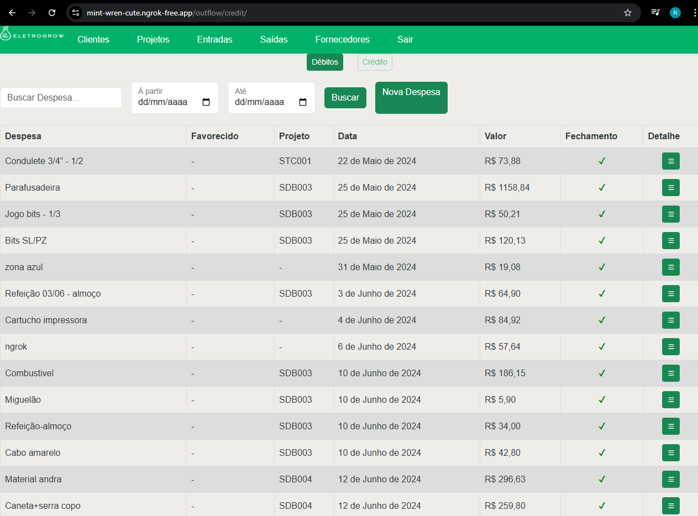

# Financeiro Eletrogrow

## Descrição

Projeto criado em Python/Django full-stack para abrigar os dados de movimentações financeiras da empresa de elétrica Eletrogrow.
Inicialmente desenvolvimento para funcionar em um servidor caseiro baseado em Raspberry Pi 3B.
Baseando-se na plataforma foiu necessário poupar recursos. Portanto o banco de dados é o SQLite, e dispensando dockerização e afins.

## Instalação

Após o clone do repositório:

```bash
pip install -r requirements.txt
```
Fazer as migrações:

```bash
python manage.py migrate
```
Criar um superuser

```bash
python manage.py createsuperuser
```
e seguir as instruções do terminal (nome de usário, e-mail, senha e confirmar senha)

Rodando em fase de desenvolvimento:

```bash
python manage.py runserver
```
## Uso

Este é um sistema onde se cadastra clientes, e inicia projetos baseado nos clientes.
Quando iniciado o projeto, o sistema gera automaticamente os valores e parcelas a serem pagas pelo cliente na aba "Entradas"
Em saídas é possível cadastrar as despesas, vincular ou não à determinado projeto, indicar o uso daquela despesa, e em caso de reembolso já cadastra novamente em entrada.

#### Então em cada dado de movimentação financeira é possível informar detalhes como:
- método de pagamento;
- data de vencimento/movimentação
- se já foi pago ou não

### Exemplo de imagem do sistema:
<p align="center">
    
</p>


#### Todo sistema também é acessível através
#### localhost:8000/admin
(se estiver rodando na porta 8000, caso do comando runserver)

## WSGI, NGinx e Ngrok
O sistema também pode ser publicado através de WSGI com quantos workers forem necessários (em RPI recomenda-se não maior que 2)
fazer comunicação com Nginx através de socket unix
e utilizar um proxy reverso (Ngrok) para publicar em serviços de internet caseiro, e rodar através de um serviço no systemctl.
É o caso como o proprietário desse repositório publica essa aplicação

Todos arquivos necessário estão disponíveis em:
- eletrogrow.conf (configuração do NGinx)
- eletrogrow.service (serviço para rodar o WSGI)
- eletrogrow_uwsgi.ini (arquivo de configuração do uwsgi)
- uwsgi_params (arquivo de parâmetros do uwsgi)

#### Comandos únicos

São comandos criados especificamente para migrações dos dados.
Antes a Eletrogrow utilizava um espaço de dados no Notion, mas então migrou para sistema próprio.
Necessário o arquivo secrets_eletrogrow.py (não disponibilizado aqui) para concluir a migração

Sequência de comandos:

```bash
python manage.py migrate_clients\
&& python manage.py migrate_projects\
&& python manage.py migrate_suppliers\
&& python manage.py migrate_inflows\
&& python manage.py migrate_outflows\
&& python manage.py migrate_credit_outflows
```
Importante ressaltar a importância de seguir a sequência devido a dependências que cada banco tem entre si.

